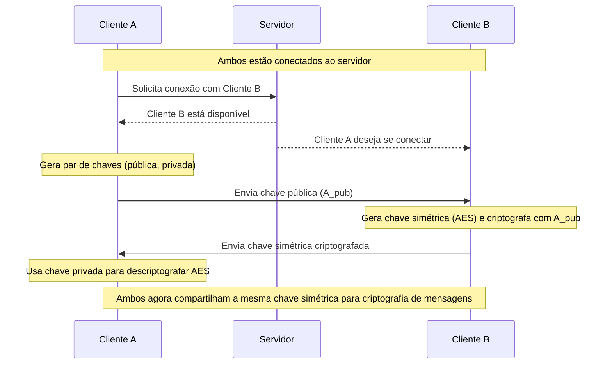
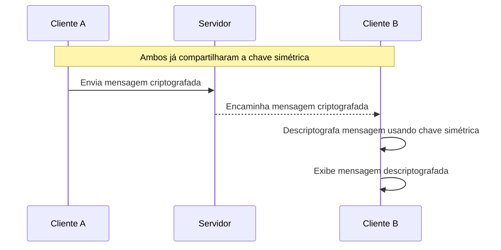
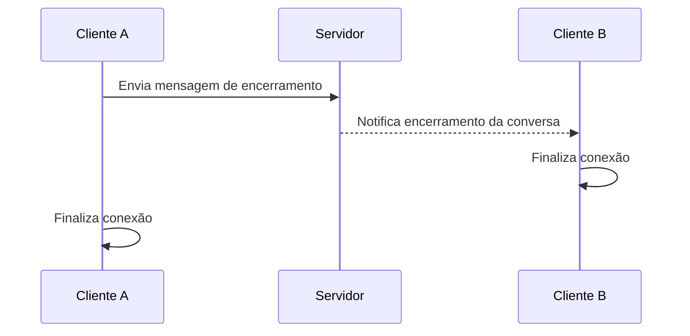

> O conteúdo a seguir é resultado completo do trabalho de TCC desenvolvido por mim e meus colegas ao término do curso de graduação em Ciência da Computação, então sim, será uma leitura extensa.
{: .prompt-info }

#### Autores

- Emanuel Chagas PINHEIRO MATTOS
- Henrique Sebastião da SILVA ROSA
- Lucas Sousa de DEUS
- Valério GONÇALVES VIEIRA Jr.
- Wanderson AMORIM PINHEIRO

#### Links

Os links dos recursos relacionados ao projeto estão listados a seguir:

- Código fonte do servidor back-end: [https://github.com/confy-security/server](https://github.com/confy-security/server){:target="_blank"}
- Código fonte do aplicativo desktop: [https://github.com/confy-security/app](https://github.com/confy-security/app){:target="_blank"}
- Código fonte do aplicativo CLI: [https://github.com/confy-security/cli](https://github.com/confy-security/cli){:target="_blank"}
- Código fonte da biblioteca `confy-addons`: [https://github.com/confy-security/confy-addons](https://github.com/confy-security/confy-addons){:target="_blank"}
- Trabalho na íntegra na web: [https://tcc.henriquesebastiao.com](https://tcc.henriquesebastiao.com){:target="_blank"}
- Código fonte da dissertação escrita com LaTeX: [https://github.com/henriquesebastiao/tcc](https://github.com/henriquesebastiao/tcc){:target="_blank"}

## Resumo

O presente trabalho tem como objetivo o desenvolvimento de um sistema de comunicação digital que utiliza criptografia de ponta a ponta (E2EE) para garantir a privacidade e a segurança das mensagens trocadas entre os usuários. Em um cenário marcado por crescentes preocupações com a proteção de dados pessoais e a vigilância digital, soluções que asseguram a confidencialidade das comunicações tornam-se cada vez mais relevantes. A pesquisa abordou os fundamentos da criptografia simétrica e assimétrica, bem como os protocolos utilizados em sistemas modernos de comunicação segura.

O sistema proposto foi desenvolvido utilizando tecnologias amplamente adotadas no mercado, como Websockets para comunicação em tempo real, e bibliotecas de criptografia como RSA e AES. A arquitetura do sistema foi pensada para minimizar a exposição dos dados, com ênfase na descentralização das chaves e na impossibilidade de interceptação por terceiros, inclusive por administradores do servidor.

Durante o processo de desenvolvimento, foram enfrentados desafios relacionados à configuração de redes, NATs e gerenciamento de conexões persistentes. A solução adotada envolveu o uso de um servidor intermediário para o estabelecimento inicial da conexão, seguida da troca direta de mensagens criptografadas entre os usuários.

Os resultados demonstram que é possível construir uma plataforma segura e funcional de troca de mensagens, mesmo com recursos limitados, contanto que sejam adotadas práticas de segurança desde as etapas iniciais do projeto. Este trabalho contribui para a disseminação do conhecimento sobre criptografia aplicada e reforça a importância da proteção da privacidade em sistemas de comunicação.

## Introdução

A evolução e a perpetuação da humanidade na linha do tempo se deve majoritariamente à capacidade dos indivíduos de estabelecerem mecanismos que possibilitem o compartilhamento e preservação de informações, seja a curto ou longo prazo, de modo a partilhar os conhecimentos adquiridos com seus sucessores.

Desde a era pré-histórica a humanidade tem desenvolvido e aperfeiçoando tecnologias que viabilizem a comunicação entre as pessoas, de modo a superar as barreiras geográficas existentes. Quanto à tecnologia, [Perles (2007, p. 4)][perles]{:target="_blank"} afirma que ela é “[...] qualquer mecanismo que possibilite ao homem executar suas tarefas fazendo uso de algo exterior ao seu corpo, ou seja, tudo aquilo que se caracteriza como extensão do organismo humano”.

Tendo início com as pinturas rupestres e evoluindo para sinais sonoros e visuais como os sinais de fumaça, o surgimento da comunicação, mesmo que ainda rudimentar, possibilitou ao homem não somente transmitir informações para além de suas capacidades fisiológicas, mas também lhe permitiu compartilhar os conhecimentos adquiridos em vida com seus descendentes.

Com o surgimento da escrita durante a Idade dos Metais (5000-4000 a.C.), na Mesopotâmia em placas de argila e no Egito já por meio de papiros, inicia-se um novo nível do desenvolvimento humano, de modo que o objetivo com o passar dos milênios se tornara a preservação da informação. Milhares de anos depois, já com o intuito não apenas de armazenar a informação, mas também de comunicar em larga escala, entre 1438 e 1440, o alemão Johann Gensfleish Gutenberg aperfeiçoou os métodos de impressão criados pelos chineses cerca de mil anos antes, possibilitando não apenas a produção de livros em grande escala, mas também propiciou o surgimento do jornal, como aborda [Guerreiro (2018)][guerreiro]{:target="_blank"}.

Acompanhando a evolução tecnológica, com o advento da eletricidade surgiu também a invenção do telégrafo que permitiu a transmissão de mensagens por meio de código Morse. Poucos anos depois, embora o italiano Guglielmo Marconi seja tido como o inventor do rádio, o certo é que em 1896 Marconi patenteou o primeiro dispositivo de transmissão sem fios, como observa [Perles (2007, p. 4)][perles]{:target="_blank"}. Marconi iniciou seus experimentos por volta de 1894, quando conseguira enviar sinais fracos a cerca de 100 metros de distância. Porém, antes que o cientista italiano tivesse êxito em suas experiências, o padre brasileiro Roberto Landell de Moura já havia transmitido voz por meio de ondas eletromagnéticas. Grecco (2007, p. 77) afirma que “Há registros de que as primeiras experiências do padre Landell com transmissões de ondas portando a voz humana teriam ocorrido entre 1893 e 1894. No mínimo um ano antes da façanha de Marconi na Itália”.

Observa-se que, desde a era do homem primitivo, os avanços tecnológicos têm ocorrido a um ritmo cada vez mais acelerado, surgindo novas e revolucionárias tecnologias entre intervalos de tempo cada vez menores. Não indiferente disso, em 1943 surgiu o computador (uma máquina enorme que realizava cálculos e ocupava uma sala inteira), mas não demorou muito para que sua dimensão fosse reduzida para poucos centímetros com a chegada dos computadores portáteis e de mão, popularmente conhecidos como *smartphones*.

Com o surgimento dos computadores o homem teve acesso a um dos últimos insumos necessários para a criação da internet, uma tecnologia que mudaria não apenas a maneira como transmitimos informação, mas a maneira como vivemos. Como que em paralelo com a invenção do computador, surge também a Arpanet em 1969, a primeira rede de computadores, com o objetivo de servir às necessidades militares dos Estados Unidos durante a Guerra Fria, no final da qual a Arpanet, agora denominada Internet, se tornou acessível por cientistas e professores universitários para troca de pensamentos e mensagens nos Estados Unidos. A partir desse ponto vimos a disseminação e popularização da rede internacional de computadores, com um crescimento vertiginoso até aos nossos dias, sendo a internet indispensável em nossas vidas, por ser uma fonte de conhecimento, interatividade, diversão e, principalmente, de comunicação, chegando ao ponto de alguns autores questionarem se a internet deveria ser um direito humano global, conforme argumentado por Reglitz (2019).

O crescimento vertiginoso das interações *online* e o fluxo de dados que transitam na internet cresceu de tal forma nos últimos anos que vemos diferentes campos da vida cotidiana intermediada por sistemas digitais. Como atestado por [Pereira (2021, p. 92)][pereira] “Em especial em 2020, com a súbita necessidade de isolamento, a modernização do serviço público e privado, a digitalização dos trabalhos e reuniões, vimos a importância da Internet crescer consideravelmente”.

### Motivação

Nesta realidade onde a Internet, se tornou como de forma nunca antes vista, uma intermediadora do tráfego de comunicações e informações, emergem, junto de todas as possibilidades, preocupações a respeito da privacidade dos indivíduos. Acontecimentos recentes ilustram muito bem essa problemática, nos quais podemos ver uma grande escalada de ataques cibernéticos acontecendo frequentemente, e até mesmo com grandes corporações. Um exemplo disso é o ataque conhecido como o *Man In The Middle* (Homem no Meio) que ocorreu com a empresa EquiFax dos Estados Unidos, em 2017, noticiado pelo Portal [G1 (2017)][g1], tratando-se da exfiltração de quase 150 milhões de dados categorizados como no ambiente de Segurança da Informação por *Personally Identifiable Information* (PII). Estas informações incluem: contatos de clientes, números de cartões de créditos, endereços, datas de nascimento e números de carteiras de motoristas. Portanto, devemos sempre nos perguntar como nossos dados estão sendo tratados no mundo digital, a cada clique, uma nova ação pode ocorrer, tornando fundamental compreender os mecanismos por trás da comunicação, sempre priorizando nossa própria segurança.

O número de crimes cibernéticos, vazamentos de dados, fraudes, situações de abuso de poder por parte de empresas ou pelo estado, têm aumentado, como explorado por [Madnick (2024)][madnick]. Como assegurar que a internet seja um ambiente seguro para comunicação, liberdade de expressão e pensamento e propicie, enfim, uma interface segura de comunicação e troca de informações entre seus usuários?

Observando esta problemática sob a ótica do tráfego de pacotes em rede, podemos visualizar o modelo de redes de computadores, que conhecemos como Modelo OSI, cuja finalidade é nortear como os pacotes são criados em baixo nível e trafegados até chegarem ao nível mais superior para o usuário, logo temos a seguinte sequência:

- Aplicação: camada de tratamento mais próxima ao usuário e os protocolos de software.
- Apresentação: camada destinada à conversão da mensagem para entrega em modelo entendível tanto para linguagem de máquina quanto à humana(dependendo do direcionamento do pacote em questão).
- Sessão: camada destinada a manusear o controle de sessão do usuário.
- Transporte: camada destinada a gerenciar o tipo de protocolo para envio da comunicação TCP/UDP.
- Rede: camada destinada a separar os *hosts* de origem e destino da nossa comunicação.
- Enlace de Dados: camada destinada ao controle de erros conhecidos como *Checksum* e aprendizagem de endereço físico entre dispositivos local conhecidos como MAC.
- Físico: esta camada é a mais baixa onde trata como o pacote será transformado para envio no meio físico, seja elétrico ou sem fio.

Tal base tornou-se essencial para a construção e aprimoramento dos modelos de protocolos de redes para a internet. Analisando toda essa cadeia de estrutura base, percebe-se a importância de avaliarmos os processos de criptografia para as camadas mais altas deste modelo, uma vez que, as camadas de aplicação se não criptografadas, possibilitam a visualização das informações em texto claro violando nossa segurança, o que muitas das vezes passa despercebido aos usuários que não tomam ciência disso.

Portanto, ao analisar a importância da internet dentre os meios de comunicações atuais, em paralelo com as vulnerabilidades cibernéticas que se mostram cada vez mais evidentes, mesmo com a implementação de medidas de proteção de dados nos meios de comunicação, chega-se à conclusão de que o desenvolvimento de um sistema de comunicação com criptografia de ponta a ponta e *Open Source*, utilizando de uma abordagem de criptografia híbrida, viabiliza a inviolabilidade da comunicação, assim como sua autenticidade. Ademais, por ser de código aberto, qualquer usuário ou pessoa que tenha interesse em auditar o código fonte da aplicação, buscando certificar-se que sua comunicação é realizada de maneira segura pela rede, pode fazê-lo sem impedimentos.

### Objetivo

Este projeto toma como iniciativa, deliberar sobre a vulnerabilidade dos dados e transparecer uma solução prática e acessível. Nessa conjuntura, o objetivo primordial deste trabalho é desenvolver um sistema de comunicação de software livre, utilizando um modelo híbrido de criptografia simétrica e assimétrica para assegurar a privacidade na troca de mensagens, além da implementação do não repúdio, o qual garante que a mensagem do remetente não possa ser contestada, desse modo temos a certeza da autenticidade da comunicação.

#### Objetivos Específicos

- Desenvolvimento da aplicação de back-end usando Python, com o auxílio de bibliotecas ou *frameworks* como por exemplo, Flask, Cryptography, Typer, dentre outras.
- Desenvolvimento de uma interface de front-end que seja amigável ao usuário, utilizando tecnologias como por exemplo, HTML, CSS, JavaScript, dentre outras.
- Uso de algoritmos de criptografia simétrica e assimétrica para implementação de metodologias criptográficas de ponta.
- Implementação de um modo de assinaturas das mensagens, garantindo não apenas a inviolabilidade da comunicação, mas também sua autenticidade.
- Comparação de diferentes algoritmos de criptografia para segurança e desempenho.
- Avaliação do impacto da criptografia na latência da comunicação.
- Testes de segurança usando ferramentas como Wireshark para avaliar se as informações são trafegadas de maneira segura.
- Testes de usabilidade com usuários para validar a experiência.

### Justificativa

As comunicações na era moderna necessitam de mais notoriedade aos pilares essenciais de segurança da informação, prezando sempre a segurança ao usuário final, seja em qual meio a comunicação ocorrer, é de suma importância a seguridade, sendo assim minimizando as chances de interceptações indevidas no tráfego. Em virtude disso, não só contribuímos para o avanço da segurança digital, mas também a importância da proteção de dados em comunicação digital.

## Referencial Teórico

### Criptografia de Mensagens

Há muitos anos, a informação é uma ferramenta crucial para se obter vantagens sobre seus concorrentes. Criptografá-la para impedir acesso por terceiros, se tornou necessário para a confiabilidade da transmissão das informações e da privacidade dos indivíduos. Assim como [Carvalho et al. (2021, p. 1)][carvalho] dizem que “Proteger mensagens e informações sigilosas é uma prática que remonta aos primórdios da humanidade, principalmente em contexto de guerra e diplomacia”.

Ao tratarmos de comunicação por meios digitais, transportando-a por intermédio de redes públicas de computadores, como é o caso da internet, torna-se imprescindível garantir a segurança dessa comunicação, de modo a garantir os fundamentos da segurança da informação, sendo eles, disponibilidade, integridade, controle de acesso, autenticidade, não-repudiação e privacidade, como aborda [Oliveira (2012)][oliveira]. Mostra-se necessária a implementação de técnicas computacionais que visam atender os requisitos para a proteção da comunicação. Nessa conjuntura, dois tipos de criptografia se mostram bastante promissores: a simétrica e a assimétrica.

#### Criptografia simétrica

No método de chave simétrica, tanto a criptografia dos dados quanto a descriptografia são feitas com base em uma única chave chamada de chave privada, também podendo ser chamada de chave secreta. Um canal seguro é necessário para compartilhar essa chave entre o remetente e o destinatário, de modo a garantir que nenhuma pessoa não autorizada possa obter a chave. A Figura ilustra o processo de criptografia simétrica.

{: width="486" }
_Processo de criptografia simétrica_

#### Criptografia assimétrica

Já na criptografia assimétrica duas chaves são necessárias: uma é a chave privada que deve ser mantida em segredo e a outra é a chave pública. A criptografia é realizada usando a chave pública, já a chave secreta é usada para descriptografar o conteúdo cifrado. Ambas as chaves são matematicamente relacionadas entre si. É importante ressaltar ainda, que não é possível descriptografar o texto com a chave pública, logo esta pode ser conhecida por pessoas terceiras. Mesmo que os sistemas assimétricos possibilitem um nível maior de segurança, eles podem não ser adequados para criptografar grandes volumes de dados, como ressalta [Alenezi, Alabdulrazzaq e Mohammad (2020)][alenezi]. Isso ocorre porque a velocidade é lenta em comparação com os sistemas baseados em chaves simétricas e eles também apresentam uma maior taxa de utilização da CPU. A Figura ilustra o processo de criptografia assimétrica.

{: width="486" }
_Processo de criptografia assimétrica_

### Camada 7 com confiabilidade

Tendo em vista que, em redes, compete a camada de aplicação garantir a segurança das informações trafegadas pelas camadas inferiores, uma vez que esta, seja a principal no objetivo de comunicar com a outra parte, onde é gerado todo o conteúdo que será lido pelo usuário de destino. Por ser o ponto final de consumo e envio de dados, essa camada se torna um alvo recorrente para ataques que buscam capturar, manipular ou redirecionar informações sensíveis.

Em ambientes abertos e descentralizados, como é o caso de aplicações com criptografia ponto a ponto (P2P), os riscos são amplificados. A segurança da aplicação não pode depender exclusivamente de mecanismos criptográficos isolados. É fundamental que o protocolo de comunicação utilizado seja projetado para resistir a ataques mesmo sob as piores condições, como destaca Vigano (2006, p. 2, tradução nossa), “Em redes abertas como a Internet, protocolos devem funcionar mesmo sob suposições de pior caso, como interceptação ou modificação de mensagens por invasores” 1.

Em um cenário cada vez mais conectado, a comunicação digital segura se tornou uma necessidade central para garantir a integridade e a privacidade das informações trocadas entre usuários. Aplicações de mensagens instantâneas, especialmente aquelas que operam em estruturas descentralizadas ou P2P, enfrentam desafios significativos quanto à proteção de dados sensíveis.

A confidencialidade das mensagens e a identidade dos participantes são aspectos críticos nesse contexto. A ausência de um controle centralizador expõe os usuários a um risco maior de interceptações, falsificações e ataques de engenharia social. Assim, a adoção de protocolos seguros e validados é essencial para resguardar os direitos fundamentais dos usuários, como o direito à privacidade.

Segundo Vigano (2006, p. 2, tradução nossa), “[...] usuários dessas tecnologias dependem de uma infraestrutura segura para garantir direitos e liberdades, como o direito à privacidade” 2. Essa afirmação reforça a ideia de que a segurança da infraestrutura digital não é apenas um requisito técnico, mas também um compromisso ético e legal, sobretudo quando se trata da troca de mensagens pessoais ou confidenciais.

Portanto, o uso de criptografia de ponta a ponta (end-to-end encryption) aliada à validação formal dos protocolos utilizados se mostra indispensável. Ferramentas como o AVISPA Tool são relevantes neste cenário, por permitirem uma análise automatizada e profunda de falhas em protocolos, incluindo casos em que a criptografia permanece intacta, mas a lógica do protocolo pode ser explorada por agentes mal-intencionados.

A proteção de dados em uma aplicação de comunicação segura, como a proposta neste trabalho, deve ser tratada desde a concepção do sistema, incorporando práticas como *privacy by design* e validação automatizada, de forma a garantir não apenas a funcionalidade da comunicação, mas também a confiança de seus usuários.

### Assinatura digital

A segurança em comunicações digitais exige que não apenas a confidencialidade seja preservada, mas também que se garanta a autenticidade da origem da mensagem, sua integridade, e, em muitos casos, o não repúdio — ou seja, que o emissor não possa negar posteriormente a autoria da mensagem enviada. Em sistemas descentralizados ou P2P, onde não há um servidor central responsável por intermediar ou validar o tráfego, essa responsabilidade recai sobre mecanismos criptográficos robustos e cuidadosamente implementados.

Aplicações de ponta adotam a arquitetura P2P com criptografia de ponta a ponta (E2EE), o que garante que apenas os dispositivos dos usuários tenham acesso ao conteúdo das mensagens. Entretanto, a ausência de um intermediário confiável exige o uso de assinaturas digitais como mecanismo de validação direta entre as partes, assegurando que o conteúdo recebido não foi alterado durante o tráfego e, mais ainda, que foi gerado pelo remetente legítimo.

Conforme apresentado por [Rahim et al. (2018, p. 2, tradução nossa)][rahim], “[...] as assinaturas digitais permitem ao destinatário verificar a autenticidade e a integridade da mensagem, e ao mesmo tempo, oferecem serviços de não repúdio”3. Esse conceito é essencial em ambientes onde a troca de informações sensíveis pode acarretar consequências legais ou operacionais, e onde os servidores não retêm cópias das mensagens para verificação posterior.

Além disso, o uso de criptografia e assinatura digital contribui para a minimização de dados, um dos pilares da proteção de dados moderna segundo legislações como a LGPD. Em vez de armazenar o conteúdo das mensagens, o sistema limita seu papel ao registro temporário da chave criptográfica pública, garantindo que nenhuma informação sensível permaneça no ambiente do servidor após o encerramento da sessão. Isso não só reduz drasticamente a superfície de ataque do sistema, como também fortalece sua conformidade com princípios legais de privacidade.

Ao incorporar práticas como assinaturas digitais baseadas em esquemas robustos (como Ong-Schnorr-Shamir), a aplicação demonstra que é possível manter a integridade da comunicação e responsabilizar os envolvidos, sem comprometer a privacidade dos usuários ou criar pontos centrais de vulnerabilidade. Trata-se de um equilíbrio técnico e ético entre segurança, autonomia e responsabilidade, que se alinha diretamente com as demandas atuais de sistemas distribuídos e respeitosos à privacidade.

### *Networking*

A utilização de criptografia fim a fim (E2EE) se destaca por sua capacidade de eliminar o acesso do provedor ao conteúdo das mensagens, promovendo um novo paradigma de segurança digital. Em aplicações tradicionais, os servidores intermediários desempenham um papel ativo no processamento das mensagens, o que os torna pontos vulneráveis a vazamentos, acesso indevido ou mesmo requisições judiciais de conteúdo. No entanto, a arquitetura E2EE rompe com essa lógica, garantindo que nem mesmo o provedor tenha acesso às mensagens trocadas entre os usuários.

De acordo com [Knodel et al. (2024, p. 4, tradução nossa)][knodel], “A criptografia de ponta a ponta (E2EE) é um padrão de segurança para comunicação no qual apenas o remetente e o destinatário pretendido podem ler as mensagens entre eles. Em particular, mesmo a plataforma não consegue ler essas comunicações, apesar de ainda atuar como intermediária”4. Esse modelo descentraliza o controle da informação, deslocando a responsabilidade da proteção para as extremidades — ou seja, os próprios dispositivos dos usuários, que são os únicos com acesso às chaves de decriptação.

A aplicação proposta neste trabalho adota esse princípio ao extremo, utilizando apenas as chaves criptográficas de cada usuário na sessão, sendo excluídas ao término da comunicação e renovadas ao início de uma nova sessão, assim como o endereço ou identificador do usuário com o qual se deseja comunicar. O conteúdo da mensagem, por sua vez, nunca transita em texto claro pelo servidor, nem tampouco é armazenado. Isso garante que, mesmo em caso de invasão ou interceptação de dados do servidor, nenhum conteúdo sensível possa ser acessado ou reconstruído.

Essa abordagem está em conformidade com as práticas modernas de segurança digital, que reconhecem o risco crescente do chamado "problema do intermediário confiável". Na prática, E2EE transforma os servidores em meros “retransmissores cegos”, incapazes de interpretar ou manipular o conteúdo que transportam. Essa é uma característica fundamental para garantir não apenas a segurança das informações, mas também a confiança do usuário no sistema.

Além disso, esse modelo fortalece o princípio do *privacy by design*, ao considerar a privacidade como um requisito estrutural da arquitetura do sistema, e não como uma camada superficial ou opcional. O mínimo armazenamento de dados sensíveis e a exclusão automática de informações auxiliares após a finalização da sessão de comunicação são componentes adicionais que reforçam a confidencialidade e reduzem a superfície de ataque do sistema.

No contexto legal, esse modelo também se alinha com os princípios estabelecidos por regulamentações como a LGPD (Lei nº 13.709/2018) no Brasil e o *General Data Protection Regulation* (GDPR) d da União Europeia. Ambas as legislações reforçam o conceito de minimização de dados, exigindo que apenas os dados estritamente necessários sejam coletados e tratados, além de garantir transparência, finalidade específica e segurança da informação.

A criptografia E2EE, ao garantir que os dados em trânsito sejam inacessíveis mesmo para o controlador, mitiga riscos regulatórios e reduz a responsabilidade legal da aplicação, principalmente no que diz respeito à guarda e exposição de dados pessoais. Como apontado por [Knodel et al. (2024, p. 4, tradução nossa)][knodel], “[...] funcionalidades de IA ou análise de dados em sistemas E2EE devem ser sempre opcionais e precedidas de consentimento explícito, dada a sensibilidade e os riscos legais envolvidos”.

A proteção de dados em uma aplicação de comunicação segura, como a proposta neste trabalho, deve ser tratada desde a concepção do sistema, incorporando práticas como *privacy by design* e *privacy by default*, promovendo a privacidade como um requisito estrutural da arquitetura, e não como uma funcionalidade opcional ou complementar. Nesse contexto, o sistema implementa validações automatizadas, limita o armazenamento de dados sensíveis, adota criptografia robusta e evita qualquer exposição desnecessária do conteúdo ao servidor, garantindo não apenas a funcionalidade da comunicação, mas também a confiança dos usuários, o fortalecimento da segurança técnica e a conformidade legal.

### Comunicação

As comunicações digitais transformaram radicalmente a maneira como as pessoas interagem, compartilham informações e constroem relacionamentos. Essas transformações só foram possíveis graças ao avanço das tecnologias que permitiram a troca de dados por meio de dispositivos conectados. Em vez de depender exclusivamente de encontros presenciais ou arquivos físicos, atualmente é possível transmitir mensagens instantaneamente entre pontos distantes, de uma forma quase imperceptível Castells (2002).

As informações trafegam de maneira organizada, segura e eficiente, graças à comunicação moderna. Para garantir que as mensagens cheguem ao destino correto, os dados percorrem uma série de camadas que se encarregam de endereçar, embalar e redirecionar os pacotes ao longo do caminho, como afirma Kurose (2013). Esses processos criam uma rede no qual dispositivos, servidores e usuários trocam informações em tempo real, de forma quase transparente ao usuário final, mas altamente complexa em seu funcionamento interno.

Nesse contexto, Stallings (2014) aborda sobre como a preocupação com a segurança se tornou um fator essencial por intermédio do aumento do volume de dados e da sensibilidade das informações transmitidas, assim como, a necessidade de garantir que apenas os envolvidos em uma conversa tenham acesso ao conteúdo trocado. Esses métodos de proteção impedem o acesso indevido, mesmo em um ambiente de rede sujeito a riscos e interferências, é possível manter a confidencialidade e a integridade da comunicação.

Além da segurança, um aspecto igualmente essencial na comunicação digital contemporânea é a capacidade de interatividade em tempo real. A troca contínua de informações entre sistemas e usuários permite que interações provém de maneira natural, como em conversas instantâneas ou em ambientes colaborativos *online*. Para viabilizar essa dinâmica, torna-se necessário adotar arquiteturas de comunicação que possibilitem conexões estáveis, bidirecionais e eficientes, mesmo diante de variações na infraestrutura da rede. Essa característica não apenas aprimora a experiência do usuário final, como também amplia significativamente as possibilidades de aplicação dessas tecnologias em diversos contextos, incluindo plataformas educacionais, serviços de atendimento ao cliente e sistemas interativos de missão crítica Tenenbaum (2011).

### Protocolo Websocket

O protocolo [Websocket](https://websocket.org/) documentado na [RFC 6455](https://tools.ietf.org/html/rfc6455) em 2011 pela *Internet Engineering Task Force* (IETF), foi desenvolvido para substituir tecnologias de comunicação bidirecional baseadas em HTTP. O protocolo permite que aplicações web se comuniquem com o servidor utilizando o protocolo TCP na camada de transporte. Embora projetado principalmente para navegadores web, o Websocket também pode ser utilizado para diferentes finalidades.

O protocolo possibilita a transmissão de mensagens contendo texto em codificação UTF-8 ou dados binários. Seu cabeçalho foi projetado para ser conciso, resultando em menor overhead e reduzindo o consumo de largura de banda. Tais características, fazem com que o protocolo seja de grande valia para o desenvolvimento da aplicação proposta neste trabalho.

O protocolo funciona estabelecendo inicialmente uma conexão entre cliente e servidor usando cabeçalho HTTP sobre um único socket TCP. Após estabelecida a conexão, o cabeçalho HTTP é substituído pelo cabeçalho Websocket, permitindo a troca simultânea de mensagens em ambas as direções através de uma conexão persistente e dedicada. Isso possibilita que o servidor envie mensagens ao cliente a qualquer momento. A confiabilidade da comunicação é assegurada por mecanismos próprios do protocolo. A Figura demonstra o processo de comunicação do protocolo Websocket.

{: width="486" }
_Demonstração da comunicação com protocolo Websocket_

### Python

O [Python](https://www.python.org/), principal linguagem de programação utilizada no desenvolvimento deste projeto, é uma linguagem de alto nível, interpretada e multiparadigma, criada por Guido van Rossum e lançada em 1991. Com uma sintaxe simples e legível, o Python foi projetado para priorizar a clareza do código e a produtividade do desenvolvedor, o que a torna uma excelente escolha tanto para iniciantes quanto para profissionais experientes.

Ao longo dos anos, o Python consolidou-se como uma das linguagens mais populares do mundo, sendo amplamente adotada em áreas como desenvolvimento web, automação de tarefas, análise de dados, inteligência artificial, ciência de dados e desenvolvimento de sistemas embarcados. Possui uma vasta biblioteca padrão e um rico ecossistema de bibliotecas e *frameworks* de terceiros, que facilitam a implementação rápida de funcionalidades complexas.

O Python adota recursos modernos como tipagem dinâmica, gerenciamento automático de memória (garbage collection), programação orientada a objetos e suporte nativo a programação assíncrona (async/await). Essas características, combinadas com a simplicidade de uso e uma comunidade ativa e colaborativa, contribuíram para o seu crescimento contínuo e adoção em larga escala por empresas e instituições de ensino.

Uma análise realizada por [Foster (2014)][foster] comparou o desempenho e a produtividade das linguagens Python, Java e C++ em tarefas computacionais diversas. O estudo concluiu que, embora Python apresente desempenho inferior em termos de tempo de execução, sua simplicidade e velocidade de desenvolvimento oferecem vantagens significativas, especialmente em projetos com foco em prototipação rápida e manutenção facilitada. Esses fatores juntamente com o fato da linguagem oferecer suporte nativo ao protocolo Websocket, reforçam a escolha do Python como linguagem principal adotada neste projeto.

### Bibliotecas e *Frameworks*

O desenvolvimento da aplicação proposta exigiu a utilização de bibliotecas e *frameworks* que oferecessem tanto robustez quanto simplicidade na implementação das funcionalidades necessárias. A escolha das tecnologias levou em consideração critérios como segurança, desempenho, facilidade de integração, suporte a padrões modernos e ampla adoção na comunidade de desenvolvimento. Dentre as diversas opções disponíveis no ecossistema Python, foram selecionadas ferramentas consolidadas e bem documentadas, capazes de atender aos requisitos técnicos do projeto com eficiência. A seguir, serão apresentadas duas dessas tecnologias essenciais: a biblioteca cryptography, utilizada para os mecanismos de criptografia e proteção de dados, e o *framework* FastAPI, responsável pela criação do servidor intermediário baseado em Websocket.

#### Cryptography

Para a implementação das funcionalidades de segurança e proteção dos dados trafegados e armazenados na aplicação, foi utilizada a biblioteca [Cryptography](https://cryptography.io/en/latest/), amplamente reconhecida na comunidade Python por sua robustez e conformidade com padrões modernos de criptografia. Desenvolvida com foco em simplicidade, desempenho e segurança, a biblioteca fornece uma interface de alto nível para algoritmos criptográficos amplamente utilizados, além de acesso a construções de baixo nível para casos mais avançados.

No contexto deste projeto, a biblioteca foi empregada para realizar tanto criptografia simétrica quanto assimétrica. A criptografia simétrica foi implementada utilizando o algoritmo AES (AES) com chave de 256 bits, conhecido como AES-256, que oferece alto grau de segurança e eficiência na codificação e decodificação de dados com uma única chave secreta. Já para a criptografia assimétrica, foi utilizado o algoritmo RSA, permitindo a troca segura de informações por meio de um par de chaves pública e privada, garantindo confidencialidade e autenticação. Essa combinação permite à aplicação proteger tanto os dados em repouso quanto os em trânsito, mantendo a integridade e a confidencialidade das comunicações entre os usuários.

A adoção da biblioteca Cryptography, aliada a boas práticas de geração e armazenamento seguro de chaves, contribuiu significativamente para o fortalecimento dos mecanismos de segurança da aplicação, alinhando-se às diretrizes de proteção de dados sensíveis exigidas em contextos de comunicação segura.

#### FastAPI

O [FastAPI](https://fastapi.tiangolo.com/) foi a tecnologia escolhida para o desenvolvimento do servidor responsável por intermediar a comunicação entre remetente e destinatário, por meio de conexões Websocket. Criado por Sebastián Ramírez e lançado em 2018, o FastAPI é um *framework* moderno para construção de APIs web em Python, baseado no padrão ASGI (*Asynchronous Server Gateway Interface*). Ele se destaca por sua performance comparável a *frameworks* escritos em linguagens compiladas, como Node.js e Go, além de oferecer tipagem forte com validação automática via [Pydantic](https://docs.pydantic.dev/latest/), documentação interativa gerada automaticamente e suporte nativo a programação assíncrona com async/await.

No contexto desta aplicação, o FastAPI será utilizado para manter sessões Websocket persistentes entre os pares, funcionando como um servidor de sinalização e retransmissão. Essa arquitetura permite contornar restrições impostas por NATs simétricos e CGNATs (*Carrier-Grade NAT*), situações comuns em redes residenciais e móveis, onde conexões diretas entre dois dispositivos são inviabilizadas. O servidor, portanto, atua como um ponto central de intermediação das mensagens, mantendo a comunicação fluida, segura e em tempo real, mesmo quando os usuários não possuem endereço IP público acessível. A escolha pelo FastAPI se justifica pela sua leveza, escalabilidade e excelente suporte para aplicações em tempo real, características essenciais para o funcionamento estável e responsivo do sistema proposto.

### Docker

Para facilitar o processo de implantação do servidor FastAPI e tornar a aplicação acessível mesmo a usuários sem experiência prévia em desenvolvimento ou configuração de ambientes, foi adotada a ferramenta [Docker](https://www.docker.com/). Lançado em 2013, o Docker é uma plataforma de virtualização leve baseada em contêineres, que permite empacotar uma aplicação juntamente com todas as suas dependências, bibliotecas e configurações em uma imagem padronizada. Isso garante que o sistema possa ser executado de forma consistente em diferentes ambientes, eliminando problemas comuns de incompatibilidade entre sistemas operacionais e versões de pacotes.

No contexto deste projeto, o Docker é utilizado para distribuir a aplicação em um formato pronto para uso, permitindo que qualquer usuário possa executar o servidor localmente ou em um VPS com um único comando, sem a necessidade de lidar com configurações complexas. Essa abordagem reforça o caráter *self-hosted* da solução, oferecendo controle total ao usuário sobre sua instância do serviço, ao mesmo tempo em que promove a portabilidade, a segurança e a facilidade de atualização da aplicação.

## Metodologia de Pesquisa

Neste capítulo foi feita uma abordagem sobre como atender as necessidades do usuário, identificando, analisando e deliberando acerca da causa raiz do problema. Foram examinadas as diversas etapas da elaboração do sistema, para de fato atender o objetivo do projeto com a finalidade de assegurar uma comunicação segura e eficiente.

Para tal objetivo, o desenvolvimento do sistema foi encaminhado em fases que envolvem tanto aspectos visuais quanto estruturais. Buscou-se, inicialmente, idealizar uma interface gráfica que facilitasse a interação do usuário, ao mesmo tempo em que se projetava a estrutura técnica responsável pela comunicação segura, sendo esta a proposta central do projeto.

### Arquitetura de Comunicação

O processo de conexão começa com o cliente, que gera um hash de ID exclusivo para identificá-lo. Este identificador, em vez do endereço IP, é enviado para o servidor. O servidor recebe esse hash de ID e o armazena em um banco de dados Redis, onde permanece ativo enquanto o usuário estiver conectado. Durante este processo, o servidor verifica se o hash do ID já existe para evitar usuários duplicados, garantindo a unicidade de cada conexão.

Essa abordagem preserva a confidencialidade do cliente, já que o endereço IP não é exposto diretamente. O hash do ID se torna a chave de acesso, permitindo que o cliente se conecte ao destino de forma controlada e segura.

{: width="486" }
_O cliente solicita ao servidor que o conecte com o usuário de destino e estabeleça a comunicação inicial para troca de mensagens_

Uma vez estabelecida a conexão, todas as mensagens transitam exclusivamente pelo servidor. É importante ressaltar que toda a comunicação é criptografada, garantindo que os dados não sejam armazenados durante a transferência. O servidor atua como um transportador ágil e seguro, encaminhando as informações diretamente para o destinatário.

Ao final da sessão, a aplicação informa ao servidor sobre o encerramento da comunicação. Os dados do usuário, incluindo o hash do ID, são mantidos no banco de dados Redis enquanto o cliente estiver ativo. Eles são excluídos apenas quando o usuário se desconecta, garantindo a limpeza e a segurança dos dados.

{: width="486" }
_O primeiro usuário que desconectar é fechada a conexão do lado que sai, e o servidor limpa seus dados salvos temporariamente_

### Prototipagem da Interface Gráfica

Como parte do processo metodológico, esta fase foi construída com o intuito de antecipar a interação entre o usuário e o sistema. Esta etapa permitiu visualizar e validar, de maneira preliminar, a estruturação dos elementos visuais, fluxos de navegação e funcionalidades básicas, antes da formação definitiva da aplicação.

A prototipagem contribui diretamente para a identificação de melhorias na experiência do usuário, da comunicação entre os integrantes da equipe e como ferramenta de análise das necessidades práticas do projeto. A partir dessa ambientação visual, foi possível ajustar funcionalidades e alinhar as decisões de design às metas de confiabilidade e usabilidade do sistema. Este levantamento está paralelo com os princípios da metodologia ágil, ao unir interações rápidas e feedback contínuo, promovendo um processo de desenvolvimento centrado no usuário e tecnicamente fundamentado.

{: width="550" }
_Protótipo inicial de baixa fidelidade da aplicação_

### Especificação de Requisitos

A especificação dos requisitos da aplicação representa uma etapa essencial no planejamento e desenvolvimento de sistemas, especialmente em projetos que envolvem múltiplas camadas de interação e preocupação com segurança, como o proposto nesta aplicação.

A definição clara e antecipada desses elementos contribui para a organização do desenvolvimento, evitando ambiguidades e mudanças frequentes de escopo. Além disso, serve como base para a validação da aplicação, garantindo que os objetivos propostos sejam efetivamente alcançados. Dessa forma, os requisitos e os casos de uso funcionam como um guia técnico e conceitual, capaz de alinhar a implementação com as reais necessidades dos usuários. 

#### Requisitos Funcionais

Os requisitos funcionais descrevem as ações que o sistema deve ser capaz de realizar. Já os casos de uso têm o papel de ilustrar, de forma prática e contextualizada, como essas funcionalidades serão acionadas pelos usuários em diferentes cenários, auxiliando na visualização do comportamento esperado do sistema.

Os requisitos funcionais descritos na tabela  têm o objetivo de especificar as funcionalidades que a aplicação proposta deve oferecer.

Desta forma, os requisitos funcionais da aplicação foram definidos e especificados como mostra a tabela a seguir.

| Código | Descrição |
| - | - |
| RF01 | O usuário deve ser capaz de se conectar ao servido |
| RF02 | O usuário deve ser capaz de criar um nome de usuário válido e único no servidor |
| RF03 | O servidor deve ser capaz de estabelecer uma conexão bidirecional ligando ambos os usuários que desejam se comunicar |
| RF04 | O usuário deve ser capaz de enviar uma mensagem para o destinatário |
| RF05 | A mensagem deve ser criptografada com a chave pública do destinatário antes de ser enviada |
| RF06 | O usuário deve ser capaz de receber uma mensagem enviada pelo destinatário |
| RF07 | A mensagem recebida deve ser descriptografada com a chave privada do usuário |
| RF08 | O usuário deve ser capaz de visualizar a mensagem recebida |
| RF09 | O usuário deve ser capaz de enviar arquivos binários (imagens, PDFs, etc.). |
| RF10 | Os arquivos binários convertidos para Base64 devem ser criptografados antes do envio |
| RF11 | As mensagens em Base64 recebidas pelo usuário devem ser convertidas de volta para o formato de arquivo correto e salvas no dispositivo |
| RF12 | O usuário deve ser capaz de se desconectar do servidor |
| RF13 | Após um usuário se desconectar, o usuário de destino deve ser avisado e sua conexão também deve ser fechada |

#### Casos de Uso

Foi elaborado um conjunto de casos de uso do sistema, demonstrado na tabela casos de uso, com o objetivo de centrar os requisitos funcionais descritos na tabela requisitos funcionais.

| Código | Descrição | Requisitos funcionais contemplados |
| - | - | - |
| UC01 | Estabelecer conexão com o servidor RF01, RF02 e RF03 |
| UC02 | Realizar comunicação entre usuários RF04, RF05, RF06, RF07, RF08, RF09, RF10 e RF11 |
| UC03 | Se desconectar do servidor RF12 e RF13 |

### Metodologias Ágeis

Para manter um ambiente organizado entre todos os participantes do projeto e garantir um bom fluxo de trabalho, a equipe concordou em utilizar uma metodologia ágil. Metodologias ágeis são um grupo de abordagens iterativas e incrementais focadas na colaboração, que têm tido um aumento de popularidade nos últimos anos. A [Capterra](https://www.capterra.com/resources/agile-project-management-statistics-for-2018/) afirma que 71% das organizações relatam utilizar abordagens ágeis.

#### Scrumban

 O Scrumban é um híbrido entre dois *frameworks* ágeis que combina a estrutura do Scrum com o sistema flexível do Kanban. Originalmente, o Scrumban foi projetado para ajudar as equipes a migrar do Kanban para o Scrum. No entanto, à medida que as equipes perceberam a flexibilidade e a capacidade de entregar continuamente usando esse método, decidiram mantê-lo, aumentando assim sua popularidade.

Do Scrum, usaremos funções, organização de backlogs, revisões regulares e perspectivas. Já do Kanban, usaremos o quadro visual, conforme ilustrado abaixo, um sistema de tarefas baseado em pulls e fluxo de código contínuo.

{: width="400" }
_Representação de um quadro de desenvolvimento com o *framework* Scrumban_

O quadro é dividido em colunas que podem ser adaptadas às nossas necessidades. Mas normalmente são utilizadas três:

1. **To do**: Tarefas pendentes.
2. **Doing**: Tarefas em andamento.
3. **Done**: Tarefas concluídas.

A seguir, apresenta-se uma demonstração do quadro de atividades do projeto, gerenciado por meio da plataforma [GitHub Projects](https://encurtador.com.br/A6PVc). Essa ferramenta foi selecionada por sua capacidade de integração com issues e pull requests, o que permite acompanhar o andamento das tarefas de maneira estruturada e eficiente, contribuindo significativamente para o planejamento e a organização das atividades do grupo ao longo do desenvolvimento do projeto.

{: width="700" }
_Quadro de atividades do projeto no Github Projects_

A adoção do Scrumban neste projeto visa equilibrar a disciplina e organização oferecidas pelo Scrum com a flexibilidade e fluidez do Kanban, proporcionando um ambiente de desenvolvimento mais adaptável e visualmente claro. Essa abordagem facilita a priorização e o acompanhamento das tarefas, promove a entrega contínua de funcionalidades e permite rápidas adaptações às mudanças de escopo, o que é especialmente útil em projetos acadêmicos com tempo limitado e objetivos bem definidos. Com o uso combinado dessas práticas ágeis, espera-se uma melhor gestão do fluxo de trabalho, maior transparência nas etapas de desenvolvimento e um aumento na eficiência da equipe durante toda a execução do projeto.

## Desenvolvimento da Aplicação

Este capítulo explora o processo de criação do sistema de comunicação com criptografia de ponta a ponta, abrangendo desde a estruturação do ambiente técnico até os procedimentos metodológicos aplicados durante a implementação. Apresentam-se as problemáticas identificadas no curso do desenvolvimento e as medidas adotadas para resolvê-las, complementado por uma visão ampla das funcionalidades implementadas e das ferramentas tecnológicas selecionadas para o projeto.

### Contextualização e Escopo da Implementação

A necessidade de desenvolver um sistema de comunicação verdadeiramente seguro emerge da análise dos problemas identificados no contexto atual da comunicação digital. Conforme evidenciado no levantamento bibliográfico apresentado no capítulo 2, os sistemas convencionais de mensagens instantâneas frequentemente falham em garantir a privacidade absoluta dos usuários, seja por questões arquitetônicas ou por modelos de negócio que dependem da análise de dados.

O desenvolvimento da solução foi orientado pela necessidade de criar um sistema de comunicação seguro que garantisse a privacidade das mensagens sem depender de infraestruturas centralizadas de terceiros. A implementação resultou em dois componentes principais: um servidor intermediário para roteamento de conexões e uma aplicação cliente desktop para interface com o usuário.

O sistema desenvolvido endereça especificamente os seguintes aspectos identificados na análise do problema:

- Eliminação de pontos centrais de acesso ao conteúdo das mensagens;
- Implementação de criptografia robusta no lado cliente;
- Simplificação da experiência do usuário para adoção por não-especialistas;
- Transparência através de código fonte aberto para auditoria.

O processo de planejamento inicial do projeto foi marcado por desafios significativos, especialmente na escolha das funcionalidades a serem incorporadas, dada a vasta gama de recursos disponíveis no mercado. Essa etapa crítica de definição de escopo foi fundamental para direcionar o desenvolvimento e garantir um caminho claro para a execução. Para prototipar as ideias e testar conceitos de interface e funcionalidade, optou-se pelo uso da biblioteca [Tkinter](https://docs.python.org/3/library/tkinter.html) para a criação do frontend, permitindo uma visualização rápida da interface gráfica da aplicação e seguir com os testes de funcionalidade das mensagens.

Concomitantemente, a segurança foi um pilar central desde o início. A implementação do backend focou em garantir a confidencialidade das comunicações. Para isso, foi utilizada a biblioteca Cryptography, com ênfase na implementação do algoritmo de criptografia RSA, um método de criptografia assimétrica. Essa abordagem manual de criptografia, em vez de depender de protocolos de segurança de transporte como o HTTPS, oferece maior controle sobre a gestão de chaves e o processo de autenticação, adaptando-se perfeitamente aos requisitos específicos do nosso sistema e garantindo uma comunicação segura e privada entre os usuários, conquanto que a nossa aplicação transmite as mensagens de ponto a ponto reforça a transparência para o servidor, cujo a função é apenas entregar as mensagens de um lado para o outro.

O desenvolvimento da aplicação foi um processo colaborativo e estruturado. Para garantir o progresso contínuo e a coesão da equipe, foram realizadas reuniões semanais. Nesses encontros, discutimos os desafios e progressos, além de dividir as tarefas entre os integrantes, o que permitiu um fluxo de trabalho eficiente e a construção simultânea de diferentes componentes do sistema.

A partir dos protótipos iniciais criados com Tkinter, que nos ajudaram a validar as ideias de interface, tomamos a decisão de migrar para uma ferramenta mais robusta e moderna. A escolha final foi a biblioteca [PySide6](https://doc.qt.io/qtforpython-6/), que oferece funcionalidades mais avançadas para a construção de uma interface gráfica completa e visualmente agradável. Essa transição foi fundamental para elevar a qualidade do produto final, garantindo um design mais polido e uma experiência de usuário aprimorada, alinhada com as expectativas de uma aplicação de comunicação contemporânea.

### Metodologia de desenvolvimento e gestão de *sprints*

Como foi explicado na contextualização do projeto, o desenvolvimento seguiu a metodologia Scrumban, que combina elementos do Scrum e do Kanban, muitas vezes referenciada por profissionais como uma abordagem híbrida que aproveita os benefícios de ambos os *frameworks*. Portanto, o desenvolvimento da aplicação foi dividido em sprints, houve um acordo entre a equipe sobre a flexibilidade das mesmas, visto que todos os envolvidos teriam que alinhar seus horários para a conclusão do projeto, ponderando entre sua vida acadêmica e profissional, o que acarretou em reuniões semanais mais dinâmicas, mas não em menor desempenho ou qualidade, assim, possibilitando manter uma cadência regular sem comprometer a qualidade das entregas como sugerido pelo *framework* Scrum.

Como o uso do Kanban também estava presente, para cada sprint ser iniciada havia requisitos claros: as atividades deveriam ser puxadas conforme sua prioridade e importância para o sistema de comunicação segura, portanto, com base na relevância dos componentes, tendo como foco inicial a conclusão dos módulos de criptografia e comunicação básica. Logo que a aplicação atingiu os requisitos mínimos de segurança esperados, com a implementação completa da criptografia RSA e do servidor de mensagens, foi possível realizar testes internos entre os membros da equipe, a fim de obter feedbacks sobre a usabilidade e eficácia do sistema.

#### Organização do fluxo de trabalho

O fluxo de trabalho seguiu uma estrutura baseada em quadro Kanban adaptado para as necessidades do projeto, com as seguintes colunas principais:

- **A Fazer**: Tarefas priorizadas e prontas para desenvolvimento;
- **Em Andamento**: Atividades em execução pelos membros da equipe;
- **Em Teste**: Componentes em fase de revisão e testes;
- **Concluído**: Funcionalidades concluídas e integradas.

#### Características de reuniões semanais

As reuniões semanais estruturaram-se em torno dos seguintes elementos:

- **Sprint Review**: Apresentação dos progressos alcançados na semana anterior, com demonstrações práticas das funcionalidades implementadas, especialmente relacionadas aos avanços na criptografia e interface gráfica.
- **Identificação de Impedimentos**: Discussão colaborativa dos desafios técnicos encontrados, particularmente aqueles relacionados à integração entre os componentes de segurança, servidor e cliente.
- **Planejamento da Próxima Sprint**: Seleção das tarefas prioritárias do backlog, considerando as dependências entre componentes e a disponibilidade dos membros da equipe.
- **Retrospectiva**: Avaliação do processo de desenvolvimento, identificando oportunidades de melhoria na metodologia aplicada e nos fluxos de comunicação da equipe.

#### Adaptações metodológicas

O projeto exigiu algumas adaptações específicas da metodologia Scrumban para atender às necessidades particulares do desenvolvimento de um sistema de comunicação segura. As sprints mantiveram duração de uma semana, mas com flexibilidade para estender discussões técnicas quando necessário, especialmente durante decisões críticas sobre a arquitetura de segurança e implementação dos protocolos de criptografia. Esta flexibilidade temporal mostrou-se essencial para garantir que questões complexas relacionadas à segurança fossem adequadamente discutidas e resolvidas.

O backlog foi constantemente refinado para refletir as descobertas técnicas e os requisitos emergentes do sistema de criptografia, permitindo ajustes de prioridade sem comprometer o cronograma geral. Essa priorização dinâmica revelou-se fundamental durante a transição de Tkinter para PySide6 e nas decisões sobre a implementação manual da criptografia RSA, onde novas necessidades técnicas emergiram e demandaram reajustes nas prioridades estabelecidas.

A abordagem Kanban facilitou a integração contínua dos componentes desenvolvidos paralelamente, essencial para um sistema onde back-end,  front-end e criptografia precisavam funcionar harmoniosamente. O fluxo contínuo de trabalho permitiu que ajustes em um componente fossem rapidamente comunicados e integrados aos demais, mantendo a consistência arquitetural e evitando retrabalhos significativos.

#### Acompanhamento de progresso e métricas

Para o gerenciamento eficaz do projeto, foi utilizado o GitHub Projects como plataforma principal para organização e acompanhamento das atividades. Esta ferramenta se integra diretamente com as issues e pull requests do repositório, proporcionando uma visão unificada do progresso do desenvolvimento e facilitando o controle das entregas.

Um dos recursos mais valiosos para a gestão ágil do projeto foi o gráfico de Burn Up, que demonstra o progresso das atividades ao longo do tempo, permitindo visualizar tanto o escopo total do projeto quanto o trabalho já concluído. Este gráfico foi fundamental para identificar tendências de produtividade, mudanças de escopo e possíveis gargalos no desenvolvimento, especialmente durante as fases críticas de implementação da criptografia e integração dos componentes.

Abaixo é possível visualizar o gráfico de Burn Up do projeto, que ilustra a evolução das entregas e o cumprimento dos marcos estabelecidos durante o desenvolvimento da aplicação de comunicação segura: 

{: width="700" }
_Gráfico de Burn Up do projeto, ilustrando a evolução das entregas e o cumprimento dos marcos estabelecidos_

O gráfico evidencia os períodos de maior intensidade no desenvolvimento, particularmente durante a implementação dos módulos de segurança e a transição entre as tecnologias de interface gráfica. As variações na curva refletem tanto as adaptações metodológicas necessárias quanto os desafios técnicos específicos encontrados no desenvolvimento de um sistema de comunicação com criptografia de ponta a ponta.

### Arquitetura implementada

A arquitetura desenvolvida seguiu o modelo cliente-servidor com criptografia de ponta a ponta, onde o servidor atua exclusivamente como facilitador de conexões sem acesso ao conteúdo das mensagens, este por sua vez pode ser hospedado por usuários voluntários e não necessariamente pelos desenvolvedores ou mantenedores.

### Ferramentas de Desenvolvimento e Qualidade de Código

Para garantir a qualidade, segurança e manutenibilidade do código desenvolvido, foram integradas ao processo de desenvolvimento diversas ferramentas especializadas que automatizaram verificações e padronizações essenciais para um projeto de comunicação segura. Essas ferramentas foram fundamentais para manter a consistência do código entre os membros da equipe e assegurar que os padrões de segurança fossem rigorosamente seguidos.

O [Ruff](https://docs.astral.sh/ruff/) foi utilizado como linter principal do projeto, responsável por identificar problemas de estilo, possíveis bugs e violações das convenções de código Python ([PEP 8](https://peps.python.org/pep-0008/)). Esta ferramenta, conhecida por sua velocidade e abrangência, permitiu que a equipe mantivesse um código limpo e consistente ao longo de todo o desenvolvimento, detectando automaticamente problemas que poderiam comprometer a legibilidade ou a manutenção futura do sistema.

Para a análise de segurança do código, foi implementado o [Bandit](https://bandit.readthedocs.io/en/latest/), uma ferramenta especializada em identificar vulnerabilidades comuns em código Python. Considerando que o projeto envolve implementação de criptografia e manipulação de dados sensíveis, o Bandit foi essencial para detectar potenciais falhas de segurança, uso inadequado de funções criptográficas e outras práticas que poderiam comprometer a integridade do sistema de comunicação segura.

A complexidade do código foi monitorada através do [Radon](https://radon.readthedocs.io/en/latest/), ferramenta que calcula métricas como complexidade ciclomática, índice de manutenibilidade e outras medidas quantitativas da qualidade do código. Esta análise foi particularmente importante para os módulos de criptografia e gerenciamento de conexões, onde a complexidade algorítmica poderia impactar tanto a performance quanto a facilidade de manutenção do sistema.

O [Taskipy](https://github.com/taskipy/taskipy) serviu como gerenciador de tarefas do projeto, permitindo a definição de comandos personalizados para execução automatizada de rotinas comuns como testes, linting, análise de segurança e deploy. Esta ferramenta simplificou significativamente o fluxo de trabalho da equipe, padronizando os comandos utilizados e garantindo que todos os membros executassem as mesmas verificações antes de cada commit.

Por fim, o [Pytest](https://docs.pytest.org/en/stable/) foi adotado como *framework* de testes, proporcionando uma estrutura robusta para a criação e execução de testes unitários e de integração. A implementação de testes automatizados foi crucial para validar o funcionamento correto dos algoritmos de criptografia, da comunicação entre cliente e servidor, e da integridade das mensagens transmitidas, garantindo que modificações no código não introduzirem regressões no sistema.

A integração dessas ferramentas no pipeline de desenvolvimento criou um ambiente onde a qualidade e segurança do código eram continuamente monitoradas, permitindo que a equipe se mantivesse focada na implementação das funcionalidades principais com a confiança de que aspectos críticos como segurança e manutenibilidade estavam sendo adequadamente controlados.

### *Back-end*

O back-end é responsável por aceitar as conexões Websocket vindas dos clientes (APPs) compatíveis com o servidor e realizar o encaminhamento de mensagens entre os usuários, garantindo a confidencialidade das comunicações, de modo que uma mensagem recebida é encaminhada diretamente para o usuário de destino sem ter seu conteúdo acessado pelo servidor. Além disso, o servidor fornece uma interface intercambiável entre clientes, podendo ser desenvolvidos diversos aplicativos clientes diferentes entre si, porém compatíveis com o mesmo servidor.

O back-end foi desenvolvido totalmente em Python utilizando o FastAPI (framework que auxilia no desenvolvimento de APIs web), o qual, ao ser executado, fornece uma API acessível através de uma URL específica para aplicativos clientes acessarem suas funcionalidades. A estrutura do projeto do servidor ficou da seguinte forma:

{: width="400" }
_Estrutura do projeto ao fim da (numero) sprint_

Outro ponto importante é que neste momento já foram adicionadas algumas dependências ao projeto que facilitaram o desenvolvimento, entre elas, é válido destacar as seguintes:

- [psutil](https://github.com/giampaolo/psutil): Biblioteca utilizada para obter informações sobre os recursos do hardware no qual o servidor está sendo executado;
- [redis](https://redis.io/): Biblioteca para gerenciamento de banco de dados de cache.

#### *Endpoints*

No diretório routers ficam localizadas as definições das regras de negócio do servidor, a maneira como ele recebe a mensagens e as retransmite para os demais usuários, na pasta routers temos os seguintes arquivos:

- `online_users.py`: Define um endpoint HTTP que verifica se um determinado nome de usuário está disponível para uso, ou seja, se não há nenhum usuário *online* no momento que esteja utilizando este nome de usuário. Caso o nome de usuário esteja disponível a resposta HTTP terá um código de status 200, caso contrário terá um código de status 409. Dessa forma, o código garante a integridade dos nomes de usuário ativos, evitando duplicidade e eventuais erros devido a conflitos de nomes de usuários;
- `status.py`: Define um endpoint HTTP que retorna informações sobre o status dos recursos da máquina em que o servidor está sendo executado, como o uso da CPU, frequência dos processadores, uso da memória, entre outras coisas;
- `ws.py`: Módulo principal do servidor, onde é definido o endpoint Websocket que trata todas as comunicações que chegam e saem do servidor. A rota definida aqui realiza tarefas cruciais para o funcionamento de todo o sistema, como armazenamento de conexões, usuários online, túneis de comunicação ativos, retransmissão de mensagens, entre outras tarefas.

#### Esquemas de validação de dados

Para realizar a validação de dados que entram e saem do servidor por meio de requisições em seus endpoints HTTP utilizamos a biblioteca Pydantic que oferece modelos de validação robustos e que se integram perfeitamente com APIs JSON, esses modelos são chamados de *schemas*.

O diretório `schemas` tem como finalidade, centralizar e gerenciar os modelos de dados utilizados pelos *endpoints* HTTP do servidor. Ela atua como um acordo técnico padronizado sobre os tipos de dados que devem ser enviados e/ou recebidos entre quem realiza uma requisição a determinado endpoint HTTP e o servidor, garantindo validação, consistência, segurança e documentação automática por meio do FastAPI.

Nos apêndices, o trecho de código em "", define alguns dos schemas de dados usados pelo FastAPI com o Pydantic no servidor. No fim deste arquivo, na seção de Apêndice, os schemas desenvolvidos até este ponto estão disponíveis.

#### Banco de dados em memória

No sistema do servidor, existe a necessidade de controlar quais usuários estão conectados em tempo real. Esse controle é fundamental para evitar que o mesmo usuário estabeleça múltiplas sessões simultâneas e para possibilitar a correta entrega de mensagens entre os pares conectados. Como essas informações são voláteis e temporárias, válidas apenas enquanto a conexão permanece ativa, não se justifica armazená-las em um banco de dados relacional tradicional, que implicaria em maior consumo de recursos e complexidade desnecessária.

Diante disso, optamos pelo uso do Redis, um banco de dados NoSQL em memória, projetado para lidar com informações temporárias de forma rápida, leve e eficiente. Sua estrutura baseada em conjuntos permite verificar de forma imediata se um usuário está *online*, além de simplificar as operações de inserção e remoção. Dessa forma, o Redis atendeu plenamente aos requisitos de baixa latência, simplicidade e desempenho em tempo real exigidos pelo sistema.

No trecho de código presente nos apêndices na seção "" é criada uma conexão assíncrona global com o Redis, usando configurações externas. Isso permite que qualquer parte do sistema, como a autenticação, o Websocket, o cache, utilize o mesmo cliente para ler e gravar dados.

O cliente Redis é utilizado principalmente no endpoint Websocket da aplicação, para realizar o registro e exclusão de usuários que estão online ou que se desconectaram, respectivamente. Os IDs dos usuários não são salvos em texto claro no Redis, mas sim um hash dos IDs, para garantir uma maior privacidade dos usuários. Na seção de Apêndice, em “”, está disponível o código da função que converte qualquer ID de usuário em um hash SHA-256, hash esse que será usado pelo servidor para armazenamento e identificação do usuário até o fim de sua conexão.

No módulo settings utilizamos uma funcionalidade do Pydantic que possibilita o carregamento automático das variáveis de ambiente presentes em um arquivo .env, essas variáveis são necessárias como configurações do Redis, sendo elas o endereço do Redis e a porta em que está sendo executado. O código que obtém os valores das variáveis de ambiente está disponível nos apêndices na seção "".

#### Execução via Docker

A execução do servidor está configurada podendo ser executada via docker compose, garantindo que todos os serviços dos quais o servidor depende sejam iniciados simultaneamente. Os três containers iniciados via docker compose são os seguintes:

- Redis - como banco de dados em memória;
- Servidor de aplicação FastAPI;
- Servidor web [Nginx](https://www.nginx.com/) - atua como proxy reverso, recebendo as requisições externas e encaminhando-as para o servidor FastAPI.

O arquivo `docker-compose.yml` define três containers que compõem a arquitetura da aplicação. O primeiro é o server, responsável por executar a aplicação FastAPI. Esse container é construído a partir do código-fonte local, recebe as variáveis de ambiente necessárias para se conectar ao Redis e está configurado para reiniciar automaticamente em caso de falhas. Além disso, ele monta o diretório do projeto dentro do container, permitindo que o código seja atualizado sem necessidade de reconstrução da imagem, e estabelece dependência direta do serviço Redis, garantindo que o banco de dados em memória esteja disponível antes de sua inicialização.

O segundo container é o web, que executa o servidor Nginx na função de proxy reverso. Ele expõe a aplicação externamente através da porta 9000 do *host*, redirecionando as requisições para o servidor FastAPI. O Nginx é configurado por meio de um arquivo de configuração customizado chamado de `nginx.conf`, o que possibilita definir regras específicas para o encaminhamento das requisições e otimizações de desempenho. Assim como o servidor de aplicação, esse container também está configurado para reiniciar automaticamente e depende do serviço server, de forma que só inicia após a aplicação estar em funcionamento.

O terceiro container é o redis, que fornece o banco de dados em memória utilizado pela aplicação para armazenamento temporário e operações de alta performance. Ele é baseado na imagem oficial do Redis em sua versão otimizada alpine, expõe a porta 6379 para permitir a comunicação entre os serviços e mantém a persistência dos dados em um volume chamado `redis_data`, evitando perda de informações em reinicializações. Esse container também está configurado para reiniciar automaticamente, assegurando sua disponibilidade contínua durante a execução do sistema.

### Cliente CLI para testes e validação

Antes de iniciar o desenvolvimento do aplicativo com interface gráfica, foi necessário criar um cliente de linha de comando CLI (CLI) para testar e validar o funcionamento do servidor e dos protocolos de comunicação implementados. Esta abordagem seguiu as melhores práticas de desenvolvimento de software, onde componentes fundamentais são testados isoladamente antes da criação de interfaces mais complexas.

O desenvolvimento do cliente CLI teve como objetivo principal verificar a integridade da comunicação Websocket, a eficácia dos algoritmos de criptografia implementados e a robustez do procedimento de troca de chaves desenvolvido. Esta ferramenta de teste permitiu que a equipe identificasse e corrigisse problemas na arquitetura do sistema antes de investir tempo no desenvolvimento da interface gráfica, economizando recursos e garantindo uma base sólida para o aplicativo final.

#### Arquitetura e funcionalidades do CLI

O cliente CLI foi desenvolvido completamente em Python, utilizando bibliotecas especializadas para cada aspecto da funcionalidade. A biblioteca [Typer](https://typer.tiangolo.com/) foi escolhida para criar a interface de linha de comando, proporcionando uma experiência de usuário intuitiva mesmo em ambiente terminal. Para a comunicação Websocket, foi utilizada a biblioteca [websockets](https://websockets.readthedocs.io/en/stable/), que oferece suporte nativo aos protocolos assíncronos necessários para a comunicação em tempo real.

A interface de entrada de dados foi aprimorada através da biblioteca [prompt-toolkit](https://python-prompt-toolkit.readthedocs.io/en/master/), que adiciona funcionalidades avançadas como histórico de comandos, auto-completar e sugestões automáticas. Esta escolha foi fundamental para facilitar os testes repetitivos durante o desenvolvimento, permitindo que os desenvolvedores reutilizassem comandos anteriores e navegassem facilmente pelo histórico de interações.

Para a exibição de informações no terminal, foi implementada a biblioteca [Rich](https://rich.readthedocs.io/en/stable/), que proporciona formatação colorida e estruturada das mensagens. Esta funcionalidade foi essencial para distinguir visualmente entre diferentes tipos de mensagens: mensagens do sistema em amarelo, mensagens criptografadas recebidas em verde, mensagens em texto puro em vermelho, e informações de depuração em azul.

#### Processo de comunicação e criptografia

O cliente CLI implementa um protocolo completo de comunicação segura que inicia com o estabelecimento da conexão Websocket utilizando um URI estruturado que inclui os identificadores do usuário remetente e destinatário, seguindo o formato `/ws/user_id@recipient_id`. Uma vez conectado ao servidor, o sistema aguarda que ambos os participantes da conversação estejam *online* para iniciar automaticamente o processo de handshake de segurança.

Assim que o destinatário se conecta, o cliente automaticamente inicia a troca de chaves públicas RSA, onde cada participante envia sua chave pública serializada em formato [base64](https://en.wikipedia.org/wiki/Base64), utilizando um prefixo específico para distinguir este tipo de mensagem das demais comunicações. Esta etapa é crucial para estabelecer a base criptográfica que permitirá a comunicação segura subsequente.

Após a troca bem-sucedida das chaves públicas RSA, um dos clientes, determinado pela comparação lexicográfica dos IDs dos usuários, assume a responsabilidade de gerar uma chave AES simétrica. Esta chave é então criptografada com a chave pública RSA do destinatário e enviada de forma segura através do canal Websocket. Esta abordagem híbrida combina a segurança da criptografia assimétrica RSA com a eficiência da criptografia simétrica AES para as mensagens subsequentes, otimizando tanto a segurança quanto o desempenho da comunicação.

Uma vez estabelecida a chave AES compartilhada entre os dois participantes, todas as mensagens de usuário são automaticamente criptografadas usando AES antes do envio e descriptografadas no momento do recebimento. Este processo é completamente transparente para o usuário, que simplesmente digita suas mensagens em texto plano, enquanto o sistema se encarrega de toda a complexidade criptográfica nos bastidores, proporcionando comunicação de ponta a ponta verdadeiramente segura.

Para organizar e processar adequadamente os diferentes tipos de mensagens trafegadas pelo sistema, foi implementado um sistema de prefixos que permite a identificação imediata do conteúdo e do tratamento necessário para cada mensagem recebida. As mensagens de controle do servidor, como notificações de conexão e desconexão de usuários, são identificadas pelo prefixo de sistema, permitindo que o cliente exiba informações relevantes sobre o estado da conexão. Durante o handshake inicial, as mensagens contendo chaves públicas RSA são marcadas com um prefixo específico de troca de chaves, enquanto a transmissão da chave AES criptografada utiliza seu próprio identificador. Por fim, todas as mensagens de usuário criptografadas com a chave AES estabelecida recebem um prefixo que indica ao receptor a necessidade de descriptografia antes da exibição.

#### Validação e testes realizados

O cliente CLI permitiu a realização de testes abrangentes que validaram aspectos críticos do sistema, incluindo a capacidade do servidor de gerenciar múltiplas conexões simultâneas, o funcionamento correto dos algoritmos de criptografia RSA e AES, a robustez do sistema em cenários de falha de rede e desconexões abruptas, além do comportamento adequado com múltiplos usuários enviando mensagens simultaneamente. Esses testes foram fundamentais para identificar e corrigir problemas relacionados ao gerenciamento de estado assíncrono, tratamento de exceções e sincronização entre processos, garantindo que o protocolo desenvolvido fosse robusto o suficiente para suportar a implementação na interface gráfica do aplicativo final.

{: width="400" }
_Cliente CLI em execução, ilustrando a interação do usuário com o sistema de mensagens_

A validação da criptografia das mensagens e do intercâmbio de chaves no início da conexão foi realizada com o auxílio do [Wireshark](https://www.wireshark.org/), um software amplamente reconhecido para análise de tráfego de rede. Essa ferramenta nos permitiu visualizar a formação dos pacotes de rede, baseando-se nas camadas do [modelo OSI](https://en.wikipedia.org/wiki/OSI_model). Assim, conseguimos confirmar a troca inicial das chaves públicas RSA e a chave AES entre os *hosts* até o momento completo da troca de mensagens estarem criptografadas, conforme demonstrado na imagem.

{: width="700" }
_Captura de tela do Wireshark durante o estabelecimento inicial da conexão entre os *peers*, conforme texto do campo *Payload*_

{: width="700" }
_Captura de tela do Wireshark durante a troca de chaves públicas RSA sendo realizada entre os *peers*_

{: width="700" }
_Captura de tela do Wireshark mostrando a troca da chave AES entre os *peers*_

{: width="700" }
_Mensagens já sendo transmitidas encriptadas com criptografia AES entre os dois hosts, a partir daqui ambos contém a chave para descriptografar a comunicação_

O processo de troca dos prefixos é visualizado no payload do frame de dados. Isso ocorre porque o protocolo Websocket utiliza o opcode Text para indicar que o conteúdo do frame é uma mensagem de texto, permitindo a transmissão de dados como as nossas troca de prefixos configuradas previamente. Além disso, é possível observar os frames de controle [PING e PONG](https://www.turfemon.com/websocket-ping-pong), que são nativos do protocolo e têm a função de verificar a atividade e a disponibilidade dos *hosts*, garantindo que a conexão permaneça estável.

### Aplicativo cliente *desktop*

Para prover uma interface amigável e de simples utilização para os usuários finais do sistema, foi desenvolvido um aplicativo cliente GUI (GUI) de aparência moderna por meio da biblioteca PySide6. Assim como o back-end, o APP cliente final também foi desenvolvido totalmente em Python. A estrutura do projeto do APP ficou da seguinte forma:

O aplicativo integra múltiplas funcionalidades essenciais para um sistema de comunicação segura, incluindo o gerenciamento de chaves criptográficas RSA, estabelecimento e manutenção de conexões Websocket com o servidor, criptografia e descriptografia de mensagens em tempo real, e uma interface de chat intuitiva que oculta a complexidade dos processos de segurança subjacentes. A estrutura do projeto do APP ficou da seguinte forma: 

{: width="250" }
_Estrutura do projeto do app_

A experiência do usuário foi priorizada desde o início do desenvolvimento, com foco na simplicidade de uso e na transparência dos processos de segurança. O aplicativo apresenta uma interface limpa e organizada, onde os usuários podem facilmente iniciar conversas, visualizar o status de suas conexões e receber feedback visual sobre o estado da criptografia de suas mensagens, tudo isso sem precisar compreender os aspectos técnicos da implementação RSA ou dos protocolos de comunicação utilizados.

#### Widgets

O PySide6 provê um conjunto de elementos de UI que auxiliam no desenvolvimentos de interfaces de usuário no estilo desktop, dentre eles o principal utilizado no projeto foi o QWidget, utilizado para criar cada janela. O APP em questão conta com três janelas ao todo, uma janela para inserir o nome de usuário de quem está se conectando e o endereço do servidor utilizado para a comunicação, uma segunda janela para inserir o nome de usuário de destinatário da comunicação e por fim a tela de conversação. Veja abaixo as respectivas telas em detalhes.

A primeira tela solicita o nome de usuário que se deseja utilizar, e o endereço do servidor que será usado para a comunicação. Vale ressaltar que o remetente e o destinatário devem utilizar o mesmo servidor para estabelecer uma conexão, caso ambos os usuários se conectem a servidores distintos entre si estes não conseguiram se comunicar.

{: width="400" }
_Tela de login do APP, onde o usuário insere seu nome de usuário e o endereço do servidor que será utilizado para a comunicação_

O endereço de servidor fornecido na primeira tela deve conter o protocolo, se é HTTP ou HTTPS, o domínio do servidor e a porta em que está sendo executado, um endereço de exemplo poderia ser `https://meuservidor.com:9000`, onde `https` é o protocolo, `meuservidor.com` o domínio do servidor e `9000` a porta em que ele está sendo executado. Por fim, caso o nome de usuário inserido já esteja ou o endereço do servidor não esteja acessível ou até mesmo caso os campos sejam deixados em branco, uma janela informando o erro será exibida.

Após clicar em conectar na primeira tela do APP, o usuário será encaminhado para a segunda tela, em que será solicitado que seja inserido o nome de usuário do destinatário, ou seja, o nome de usuário da pessoa com a qual se deseja conversar.

{: width="400" }
_Tela de destinatário do APP, onde o usuário insere o nome de usuário da pessoa com a qual se deseja comunicar_

Por fim, ao clicar novamente em conectar o usuário será conectado ao usuário de destino e a comunicação poderá ser iniciada, caso o usuário de destino ainda não esteja conectado, o primeiro usuário deverá aguardar e quando o destinatário será conectado o primeiro usuário será notificado. Assim que os dois usuários estiverem devidamente conectados eles podem dar sequência a conversa como demonstrado na imagem abaixo:

{: width="500" }
_Tela de conversação do APP, onde o usuário pode enviar e receber mensagens de texto em tempo real_

O protocolo de comunicação e criptografia implementado no aplicativo de interface gráfica mantém exatamente a mesma arquitetura e procedimentos validados anteriormente no cliente CLI. Todo o fluxo de estabelecimento de conexão Websocket, handshake de chaves públicas RSA, geração e troca segura de chaves AES, além do sistema de prefixos para classificação de mensagens, foi integralmente preservado na implementação do aplicativo desktop. Esta consistência arquitetural garantiu que a robustez e segurança comprovadas durante os testes com o cliente CLI fossem mantidas na versão final do produto, proporcionando aos usuários finais o mesmo nível de proteção criptográfica em uma interface amigável e intuitiva. A reutilização deste protocolo também permitiu que o foco do desenvolvimento da interface gráfica fosse direcionado exclusivamente para a experiência do usuário e funcionalidades visuais, uma vez que os aspectos críticos de segurança já haviam sido extensivamente testados e validados.

Além disso, como ambas as implementações seguem exatamente o mesmo protocolo de comunicação, existe total interoperabilidade entre os clientes, permitindo que um usuário utilizando o cliente CLI se comunique perfeitamente com outro usuário que esteja usando o aplicativo de interface gráfica, e vice-versa. Esta compatibilidade cruzada demonstra a solidez do protocolo desenvolvido e oferece flexibilidade aos usuários na escolha da interface que melhor se adequa às suas necessidades ou preferências. A reutilização deste protocolo também permitiu que o foco do desenvolvimento da interface gráfica fosse direcionado exclusivamente para a experiência do usuário e funcionalidades visuais, uma vez que os aspectos críticos de segurança já haviam sido extensivamente testados e validados.

#### Integração e entrega contínua com GitHub Actions

A integração e entrega contínua (CI/CD) representa uma das práticas fundamentais do desenvolvimento de software moderno, permitindo a automação de processos de construção, teste e distribuição de aplicações de forma eficiente e confiável. No contexto de aplicações desktop, essas práticas se tornam ainda mais relevantes devido à necessidade de gerar builds específicas para diferentes sistemas operacionais e arquiteturas, garantindo que os usuários finais tenham acesso facilitado às versões mais atualizadas do software sem comprometer a qualidade ou segurança das distribuições.

No projeto do aplicativo desktop oi implementado um pipeline de CI/CD que é acionado sempre que uma nova versão do app for lançada e enviada para o [GitHub](https://github.com/home), esse pipeline automatiza o processo de build e empacotamento de uma nova versão do app para instaladores nativos para os sistemas operacionais Microsoft Windows e as principais distribuições Linux, entre elas, Ubuntu, Fedora, Arch Linux, entre outras. Após o empacotamento os binários instaladores são anexados à publicação de lançamento da versão no GitHub para que os usuários possam realizar o download dos mesmos. Na imagem abaixo é possível visualizar o status e tempo de execução de cada CI de build dos instaladores via GitHub Actions, incluindo o total de empacotamento de todos os instaladores:

{: width="400" }
_Status do pipeline de CI/CD via GitHub Actions_

Nos apêndices no final deste arquivo é possível ver o código que define o workflow de build em "”.

## Resultados

O presente capítulo apresenta o relato metodológico, os experimentos realizados e os resultados obtidos até o momento no desenvolvimento do sistema de comunicação segura com criptografia ponta a ponta (E2EE).

O objetivo central desta fase foi consolidar o funcionamento prático do sistema de mensagens entre clientes, intermediado por um servidor, sem exposição de dados sensíveis e com a adoção de técnicas avançadas de segurança, como o *Perfect Forward Secrecy* (PFS), que garante que cada sessão utilize chaves criptográficas temporárias e independentes.

### Metodologia

Para o desenvolvimento da aplicação, optou-se pela linguagem Python e por uma arquitetura cliente-servidor que utiliza o protocolo Websocket, garantindo uma comunicação bidirecional e em tempo real. O funcionamento do sistema se baseia na interação de três componentes essenciais. No centro da arquitetura opera um servidor intermediário, que atua exclusivamente como um roteador para as mensagens e chaves públicas trocadas, sendo projetado para nunca ter acesso ao conteúdo descriptografado das comunicações, o que assegura a confidencialidade. O processo tem início quando um cliente remetente (Cliente A) gera sua chave pública RSA e a envia ao servidor. Para estabelecer a conexão, o cliente destinatário (Cliente B) requisita essa chave pública ao servidor, possibilitando assim o início da troca de mensagens criptografadas de ponta a ponta.

#### Modelo de Criptografia

Para a criptografia da comunicação foi adotada uma metodologia híbrida, combinando criptografia RSA (assimétrica) para troca segura da chave AES entre os pares e criptografia AES (simétrica) para criptografia das mensagens de texto. Essa combinação é amplamente utilizada em sistemas modernos (ex.: Signal, WhatsApp), pois permite desempenho e segurança equilibrados.

As etapas realizadas pelo sistema para estabelecimento da comunicação criptografada são descritas abaixo:

- O cliente A gera um par de chaves RSA (pública e privada).
- O cliente B solicita a chave pública de A ao servidor.
- B gera uma chave de sessão AES aleatória.
- B criptografa a chave AES com a chave pública RSA de A.
- B envia a chave AES cifrada ao A via servidor.
- A descriptografa a chave AES com sua chave privada.
- A e B agora têm a mesma chave AES, e toda mensagem passa a ser cifrada com ela.

#### Implementação do *Perfect Forward Secrecy* (PFS)

Visando a um padrão de segurança mais robusto, a arquitetura do sistema incorpora o princípio de *Perfect Forward Secrecy* (PFS). A principal garantia oferecida pelo PFS é que o comprometimento de chaves de longo prazo não afeta a confidencialidade de sessões de comunicação anteriores, pois cada sessão utiliza um conjunto de chaves criptográficas efêmeras.

A implementação deste conceito no protótipo se manifesta no ciclo de vida das chaves: para cada nova conexão Websocket, um par de chaves RSA efêmero é gerado pelo cliente. A subsequente troca de chaves públicas é automatizada no início da sessão, o que permite a derivação de uma chave de sessão AES exclusiva. Ao encerrar a comunicação, todas as chaves associadas àquela sessão são permanentemente descartadas da memória. Esta abordagem impede a descriptografia retroativa de mensagens e atende aos requisitos de sigilo efêmero (ephemeral secrecy) e não-reutilização de chaves, práticas consideradas fundamentais na segurança de comunicações contemporâneas.

### Fluxo Lógico da Comunicação

A comunicação na aplicação é fundamentada em uma arquitetura cliente-servidor que utiliza o protocolo Websocket para estabelecer um canal de comunicação bidirecional e em tempo real entre os usuários. A escolha por Websockets permite que o servidor atue como um intermediário de sinalização e retransmissão, gerenciando as sessões ativas e garantindo a entrega eficiente de mensagens. Essa abordagem é particularmente eficaz para contornar restrições de rede, como as impostas por NATs (*Network Address Translation*), que frequentemente impedem conexões diretas entre dispositivos.

O fluxo de comunicação envolve quatro etapas principais: a conexão inicial do usuário, a troca segura de chaves criptográficas, o envio e recebimento de mensagens e, por fim, o encerramento da conexão.

#### Conexão do Usuário ao Servidor

O processo é iniciado quando um usuário se conecta ao servidor, fornecendo seu nome de usuário, que serve como identificador único, e o endereço do servidor. O servidor valida se o nome de usuário já está em uso; caso esteja, a conexão é recusada. Em seguida, o usuário informa o nome do destinatário com quem deseja se comunicar. Com essas informações, o cliente estabelece uma requisição Websocket a um endpoint específico, que identifica tanto o remetente quanto o destinatário.

#### Troca de Chaves Criptográficas

Uma vez que ambos os usuários estejam conectados, o sistema inicia o processo de estabelecimento de um canal de comunicação seguro. Para isso, adota-se um modelo de criptografia híbrida. Primeiramente, utiliza-se a criptografia assimétrica para a troca segura de uma chave de criptografia simétrica. A criptografia simétrica, por ser mais eficiente, é então empregada para cifrar todas as mensagens subsequentes.

O fluxo de troca de chaves ocorre da seguinte maneira:

- O cliente que iniciou a conexão gera um par de chaves assimétricas (pública e privada) e envia sua chave pública ao destinatário por meio do servidor.
- O destinatário recebe a chave pública, gera uma chave simétrica, criptografa esta chave simétrica com a chave pública recebida e a envia de volta ao remetente.
- O remetente, ao receber a chave simétrica criptografada, utiliza sua chave privada para descriptografá-la.

Ao final deste processo, ambos os usuários possuem a mesma chave simétrica compartilhada, permitindo o início da comunicação segura. O fluxograma abaixo ilustra esta etapa.

#### Envio e Recebimento de Mensagens

Com o canal seguro estabelecido, os usuários podem trocar mensagens com confidencialidade. Toda a criptografia é realizada no aplicativo cliente, sem exigir ação do usuário. O remetente criptografa a mensagem usando a chave simétrica compartilhada e a envia ao servidor. O servidor atua exclusivamente como um retransmissor: ele recebe a mensagem cifrada e a encaminha imediatamente ao destinatário, sem ter a capacidade de acessar seu conteúdo. O destinatário, por sua vez, recebe a mensagem e utiliza a mesma chave simétrica para descriptografá-la, exibindo o conteúdo original em sua interface. É fundamental ressaltar que o servidor não armazena as mensagens nem as chaves criptográficas, garantindo a privacidade da comunicação.

#### Encerramento da Conexão

Ao final da conversa, qualquer um dos usuários pode iniciar o processo de encerramento. Para isso, o cliente envia uma mensagem de encerramento ao servidor, que a retransmite ao outro participante. Após a notificação, ambas as partes finalizam suas respectivas conexões com o servidor.

### Experimentos Realizados

#### Experimento 1 – Troca de chaves públicas RSA

O primeiro experimento foi delineado para validar a robustez e a confiabilidade do mecanismo de troca de chaves públicas RSA. Objetivo: Garantir que os clientes pudessem obter as chaves públicas uns dos outros de forma consistente, sem falhas, corrupção de dados ou duplicações. Procedimento: O fluxo do teste seguiu três passos sequenciais:
 
- O Cliente A iniciava a conexão e enviava sua chave pública recém-gerada para o servidor.
- O Cliente B, ao se conectar, solicitava ao servidor a chave pública do Cliente A.
- Para verificação de integridade, o Cliente B calculava o fingerprint SHA-256 da chave recebida e o comparava com o fingerprint original (previamente conhecido ou verificado fora de banda), garantindo que a chave não foi alterada durante o trânsito.

Resultados: A execução do experimento demonstrou o sucesso da implementação, com os seguintes resultados observados:

- Sucesso na troca: A taxa de sucesso para a conclusão das trocas de chaves foi de 100%.
- Consistência dos dados: O fingerprint da chave manteve-se consistente em todas as sessões testadas, confirmando a integridade dos dados transmitidos.
- Ausência de duplicatas: Não foi registrada nenhuma duplicação ou atribuição incorreta de chaves durante os testes.

#### Experimento 2 – Envio e Recepção de Mensagens Criptografadas

Este segundo experimento foi desenhado para avaliar o ciclo completo da comunicação, focando na confidencialidade e na integridade das mensagens trocadas entre os clientes. Objetivo: Verificar a integridade ponta a ponta das mensagens criptografadas com AES, cuja chave foi trocada de forma segura utilizando RSA, e confirmar que o conteúdo se mantém confidencial durante o trânsito na rede. Procedimento: O teste foi executado seguindo os seguintes passos:

- O Cliente A enviava uma mensagem de teste pré-definida (“teste123”) para o Cliente B.
- Simultaneamente, o tráfego de rede era capturado com a ferramenta Wireshark para inspecionar os pacotes e garantir que o conteúdo da mensagem não trafegava de forma legível (texto plano).
- Após o Cliente B receber e descriptografar a mensagem, o hash SHA-256 do conteúdo recebido era calculado e comparado com o hash da mensagem original enviada pelo Cliente A, a fim de validar sua integridade.

Resultados: A análise dos dados coletados permitiu obter as seguintes conclusões:

- Integridade da Mensagem: A comparação de hashes SHA-256 obteve 100% de correspondência, o que resultou em uma taxa de 0% de falhas no processo de descriptografia. Isso confirma que as mensagens não foram corrompidas durante a transmissão.
- Confidencialidade: A inspeção do tráfego de rede via Wireshark demonstrou que nenhum texto legível foi detectado nos pacotes interceptados, validando a eficácia da criptografia em trânsito.
- Desempenho: O tempo médio aferido para o processo completo, desde a cifragem no remetente até a recepção pelo destinatário, foi de 65 ms.

#### Experimento 3 – Teste de *Perfect Forward Secrecy* (PFS)

O terceiro e último experimento foi projetado para validar a correta implementação do *Perfect Forward Secrecy* (PFS), focando na capacidade do sistema de gerar chaves de sessão efêmeras. Objetivo: Verificar se um novo e único par de chaves criptográficas era gerado para cada sessão de comunicação estabelecida entre os mesmos clientes, garantindo assim a rotatividade das chaves. Procedimento: O teste seguiu um método comparativo sequencial:

- Uma primeira sessão de comunicação foi estabelecida entre o Cliente A e o Cliente B.
- O fingerprint SHA-256 da chave pública RSA utilizada nesta sessão foi armazenado para referência.
- A conexão foi encerrada e, imediatamente, uma segunda sessão foi iniciada entre os mesmos dois clientes.
- O fingerprint da chave pública da nova sessão foi então comparado com o fingerprint armazenado da sessão anterior.

Resultados: A análise comparativa confirmou o funcionamento esperado do PFS:

- Rotação de Chaves: Em 100% dos casos testados, o fingerprint da chave da segunda sessão foi distinto do fingerprint da primeira. Isso comprova que um novo e exclusivo par de chaves RSA foi gerado para a nova conexão, conforme o princípio do PFS.
- Funcionalidade: Não foi registrado nenhum erro de descriptografia ou falha de comunicação durante a transição entre as sessões, indicando que o ciclo de vida das chaves efêmeras foi implementado corretamente sem comprometer a estabilidade do sistema.

### Testes de Usabilidade e Feedback

Além da validação funcional e de segurança, foi conduzida uma etapa de testes de usabilidade para avaliar a interação e a experiência do usuário com a aplicação. Esta avaliação foi dividida em duas frentes, abrangendo tanto a interface de linha de comando (CLI), desenvolvida nas fases iniciais, quanto a aplicação final com sua interface gráfica (GUI), implementada com PySide6. O objetivo era coletar feedback qualitativo sobre a facilidade de uso, a clareza do fluxo de comunicação e a percepção geral de segurança.

Os testes com a versão CLI foram direcionados a um público com maior familiaridade técnica. O feedback recebido foi predominantemente positivo, destacando a clareza da sintaxe dos comandos, a lógica sequencial para iniciar uma conversa e a eficiência para realizar operações de forma rápida. O sistema de feedback textual foi considerado informativo e suficiente para guiar o usuário durante o processo de troca de chaves e envio de mensagens, validando a CLI como uma ferramenta robusta e eficaz para seu público-alvo.

Posteriormente, a avaliação da interface gráfica (GUI) foi realizada com um grupo de usuários mais diversificado. Os resultados foram igualmente encorajadores, com os participantes elogiando a intuitividade da navegação e a disposição clara dos elementos visuais. O processo para estabelecer uma comunicação segura foi descrito como simples e direto, demonstrando que a GUI cumpre com sucesso seu objetivo de abstrair a complexidade criptográfica e reduzir a barreira de entrada para a utilização do sistema. Em síntese, o feedback geral valida que a aplicação, em suas duas vertentes, proporciona uma experiência de usuário funcional e positiva.

### Análise dos Resultados

Com base nos testes sistemáticos realizados, a análise dos resultados permite concluir que o modelo de criptografia de ponta a ponta (E2EE), fortalecido pela implementação de *Perfect Forward Secrecy* (PFS), atinge os objetivos de segurança propostos. A arquitetura demonstrou garantir o sigilo absoluto do conteúdo das mensagens, uma vez que a chave de descriptografia permanece exclusivamente sob o controle dos usuários finais, tornando a informação ilegível mesmo para o servidor que a retransmite. A rotatividade de chaves efêmeras, validada no Experimento 3, assegura que sessões de comunicação passadas não possam ser descriptografadas retroativamente.

Adicionalmente, o impacto sobre a performance foi mínimo, introduzindo uma sobrecarga média de apenas 20 ms por mensagem, o que evidencia um equilíbrio eficiente entre segurança e usabilidade. Em suma, os resultados dos experimentos convergem para confirmar a viabilidade técnica do protótipo, estabelecendo-o como um fundamento robusto para a construção de sistemas de comunicação que primam pela segurança e privacidade.

### Conclusão Parcial

Com a implementação da interface gráfica (GUI) utilizando a biblioteca PySide6, a aplicação alcançou um nível satisfatório de usabilidade e uma experiência visual funcional. Este marco representa a conclusão da fase de prototipagem, validando a arquitetura central de comunicação. No entanto, o estado atual serve como um alicerce sobre o qual aprimoramentos significativos devem ser construídos, abrangendo os âmbitos técnico, de segurança e de desempenho.

Os próximos passos se concentram em fortalecer a robustez da segurança. Planeja-se implementar um gerenciamento de sessão mais sofisticado, com controle de expiração de chaves AES e um sistema automatizado para sua troca periódica. Tal medida aprimora o Perfect Forward Secrecy e garante a confidencialidade retroativa das mensagens. Complementarmente, será desenvolvido um módulo de auditoria com logs criptográficos, permitindo que eventos do sistema, como conexões e erros, sejam registrados de forma segura e autenticada, garantindo a rastreabilidade sem comprometer a privacidade.

No que tange à escalabilidade e ao desempenho, é fundamental a criação de um conjunto de testes automatizados de carga. Utilizando ferramentas como Locust ou k6, será possível simular múltiplos usuários simultâneos para mensurar a latência e a estabilidade do servidor Websocket sob alto volume de tráfego, identificando gargalos e otimizando a infraestrutura para um uso em maior escala.

Visando enriquecer a experiência do usuário, a evolução da aplicação incluirá funcionalidades de interatividade em tempo real, como indicadores de status de presença ("*online*/*offline*", "digitando") e confirmações de entrega e leitura. Além disso, será integrada uma função de backup e sincronização de mensagens em nuvem privada, permitindo que o usuário exporte e mantenha seu histórico de conversas de maneira segura e portável, sem abrir mão da criptografia de ponta a ponta.

[guerreiro]: https://recil.ulusofona.pt/server/api/core/bitstreams/2c4bdf4c-4206-46f2-b08d-60eacb8e038a/content
[perles]: https://www.bocc.ubi.pt/texts/perles-joao-comunicacao-conceitos-fundamentos-historia.pdf
[pereira]: https://www.academia.edu/48266173/Curso_livre_Estrutura_e_funcionamento_da_Internet_aspectos_t%C3%A9cnicos_pol%C3%ADticos_e_regulat%C3%B3rios_2020_#page=92
[g1]: https://g1.globo.com/tecnologia/noticia/equifax-empresa-de-credito-dos-eua-sofre-ataque-hacker-e-dados-de-143-milhoes-de-pessoas-sao-expostos.ghtml
[madnick]: https://www.wsj.com/tech/cybersecurity/why-are-cybersecurity-data-breaches-still-rising-2f08866c
[carvalho]: https://ic.unicamp.br/~reltech/PFG/2021/PFG-21-45.pdf
[oliveira]: https://ronielton.eti.br/publicacoes/artigorevistasegurancadigital2012.pdf
[alenezi]: https://www.researchgate.net/profile/Haneen-Alabdulrazzaq/publication/349324592_Symmetric_Encryption_Algorithms_Review_and_Evaluation_study/links/602acfa7a6fdcc37a82c0189/Symmetric-Encryption-Algorithms-Review-and-Evaluation-study.pdf
[rahim]: https://arxiv.org/pdf/1811.02120
[knodel]: https://arxiv.org/pdf/2412.20231
[foster]: https://www.researchgate.net/profile/Elvis-Foster/publication/320407173_A_COMPARITIVE_ANALYSIS_OF_THE_C_JAVA_AND_PYTHON_LANGUAGES/links/59e2d86b458515393d57fefa/A-COMPARITIVE-ANALYSIS-OF-THE-C-JAVA-AND-PYTHON-LANGUAGES.pdf